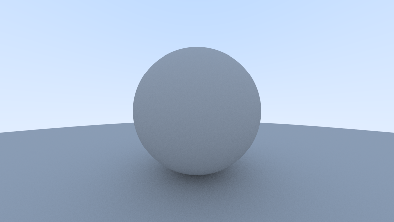

# raytracer
A simple ray tracer written in rust.

## Features
 - [x] Diffuse
 - [x] Multithreading
 - [ ] Metal
 - [ ] Glass
 - [ ] DOF

## Usage

```
cargo run --quiet --release > image.ppm
```

## Showcase

### Lambertian sphere



## Reference
[_Ray Tracing in One Weekend_](https://raytracing.github.io/books/RayTracingInOneWeekend.html)